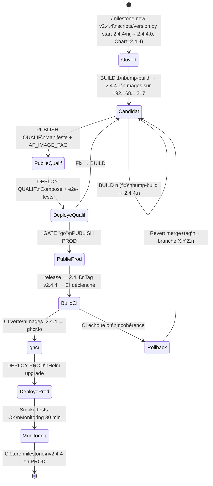

# Gestion des Versions — Automation Factory

> **Effective depuis v2.4.4** (2026-09-18) — Migration du format `X.Y.Z[-rc.n]` vers `X.Y.Z.a`

## Format de version

| Composant | Description | Gestion | Exemple |
|-----------|-------------|---------|---------|
| **X** | Version majeure (breaking changes, DB) | Titre milestone GitHub | `2` |
| **Y** | Version mineure (features) | Titre milestone GitHub | `4` |
| **Z** | Version patch (bugfixes) | Titre milestone GitHub | `4` |
| **.a** | Compteur de build (dev/staging) | Auto-incrémenté par BUILD | `1`, `2`, `3`… |

**Format complet** :
- **Dev/Staging** : `X.Y.Z.a` (ex: `2.4.4.3` — 3ème build du cycle)
- **Production** : `X.Y.Z` (ex: `2.4.4` — sans compteur, valeur figée)

---

## Affichage par environnement

| Environnement | Variable | Version | is_rc | build |
|---------------|----------|---------|-------|-------|
| **PROD** | `ENVIRONMENT=PROD` | `2.4.4` | `false` | `null` |
| **STAGING** | `ENVIRONMENT=STAGING` | `2.4.4.3` | `true` | `3` |
| **DEV** | `ENVIRONMENT=DEV` | `2.4.4.0` | `true` | `0` |

**Sémantique** :
- `is_rc=true` + `build !=null` → candidat de build (staging/dev)
- `is_rc=false` + `build=null` → release figée (production)

---

## Contrat API : `GET /api/version`

```json
{
  "version": "X.Y.Z.a | X.Y.Z",
  "base_version": "X.Y.Z",
  "internal_version": "X.Y.Z.a",
  "build": "integer | null",
  "environment": "PROD | STAGING | DEV",
  "name": "Automation Factory",
  "description": "…",
  "is_rc": "boolean",
  "is_build_candidate": "boolean",
  "features": {…}
}
```

**Exemples** :
```json
// STAGING (2.4.4.3 — 3ème build)
{
  "version": "2.4.4.3",
  "base_version": "2.4.4",
  "build": 3,
  "is_rc": true,
  "is_build_candidate": true
}

// PROD (2.4.4 figé)
{
  "version": "2.4.4",
  "base_version": "2.4.4",
  "build": null,
  "is_rc": false,
  "is_build_candidate": false
}
```

---

## Outil unique : `scripts/version.py`

Centralise la lecture/écriture des versions pour éviter les écrasements accidentels (ex: `echo >` qui écraserait `VERSION_FEATURES`).

### Commandes

| Commande | Sortie | Fichiers touchés | Usage |
|----------|--------|------------------|-------|
| `get` | `X.Y.Z.a` | — | Lire version brute |
| `get --base` | `X.Y.Z` | — | Lire version base (clé `VERSION_FEATURES`) |
| `get --build` | `a` | — | Lire compteur (ou vide) |
| `start X.Y.Z` | `X.Y.Z.0` | `version.py`, `package.json`, `Chart.yaml`, `package-lock.json` | **Ouverture de cycle** |
| `bump-build` | `X.Y.Z.(a+1)` | `version.py`, `package.json`, `package-lock.json` | **À chaque BUILD** |
| `release` | `X.Y.Z` | `version.py`, `package.json`, `package-lock.json` | **PUBLISH PROD** |
| `check [--tag vX.Y.Z]` | exit 0/1 | — | Valider cohérence/format |

### Exemples

```bash
# Ouverture cycle v2.4.4
python3 scripts/version.py start 2.4.4
# → version.py: __version__ = "2.4.4.0"
# → package.json: "version": "2.4.4.0"
# → Chart.yaml: version: "2.4.4", appVersion: "2.4.4"

# BUILD 1
python3 scripts/version.py bump-build
# → version.py: __version__ = "2.4.4.1"
# → package.json: "version": "2.4.4.1"
# Staging affiche : version="2.4.4.1", is_rc=true, build=1

# BUILD 2 (suite à un fix)
python3 scripts/version.py bump-build
# → version.py: __version__ = "2.4.4.2"

# PUBLISH PROD (retirer .a)
python3 scripts/version.py release
# → version.py: __version__ = "2.4.4"
# → package.json: "version": "2.4.4"
# Prod affiche : version="2.4.4", is_rc=false, build=null
```

---

## Implémentation backend

**Fichier** : `backend/app/version.py`

```python
__version__ = "2.4.4"  # ou "2.4.4.3" en dev/staging

def parse_version(version_str):
    """Accepte X.Y.Z, X.Y.Z.a, legacy X.Y.Z-rc.n, X.Y.Z_n"""
    # Retourne (base_version, build_counter)

def get_display_version():
    """Retourne la version affichée selon ENVIRONMENT"""
    # PROD: retirer le .a
    # STAGING/DEV: afficher complet

def get_version_info():
    """Retourne le dict /api/version"""
    return {
        "version": display_version,
        "base_version": base,
        "internal_version": __version__,
        "build": build_counter,
        "is_rc": build_counter is not None and ENVIRONMENT != "PROD",
        "is_build_candidate": (idem),
        …
    }
```

---

## Implémentation frontend

**Fichier** : `frontend/src/hooks/useVersionInfo.ts`

```typescript
export function useVersionInfo(): VersionInfo {
  // En PROD : strip le 4e segment
  // Accepte legacy -rc.n
  // Expose build?, is_build_candidate?
  
  // Exemple STAGING:
  // Input: "2.4.4.3"
  // Output: version="2.4.4.3", build=3, is_build_candidate=true
  
  // Exemple PROD:
  // Input: "2.4.4"
  // Output: version="2.4.4", build=null, is_build_candidate=false
}
```

**Frontend nginx** : `frontend/docker-entrypoint.sh`
- Remplace `{{FRONTEND_VERSION}}` par la version depuis `package.json`
- **Sed limité à la ligne `/version`** (non global, pour ne pas mutiler les IPs `a.b.c.d`)
- Retire le 4e segment (`.a`) en prod via sed ciblé

---

## Configuration Docker

### `docker-compose.staging.yml`

```yaml
services:
  backend:
    image: automation-factory-backend:${AF_IMAGE_TAG:?AF_IMAGE_TAG required}
    environment:
      ENVIRONMENT: STAGING
      …
  frontend:
    image: automation-factory-frontend:${AF_IMAGE_TAG:?AF_IMAGE_TAG required}
    environment:
      ENVIRONMENT: STAGING
```

**Prérequis** : Variable d'env `AF_IMAGE_TAG=X.Y.Z.a` (ex: `2.4.4.3`)  
Utilisée uniquement en QUALIF (staging) — PROD via Helm `custom-values.yaml`

### `docker-compose.yml`

```yaml
# Référence locale — jamais utilisé en production
# TAG exemple : X.Y.Z.a (ex: 2.4.4.1)
services:
  backend:
    image: automation-factory-backend:2.4.4.1
```

### `helm/automation-factory/Chart.yaml`

```yaml
apiVersion: v2
name: automation-factory
version: 2.4.4  # X.Y.Z uniquement, JAMAIS 4 segments
appVersion: 2.4.4  # Aligné sur version: 
```

**Important** : `version` et `appVersion` n'ont **jamais** de 4e segment (SemVer 2 Helm strict)  
Écrit une seule fois à l'ouverture du cycle par `scripts/version.py start X.Y.Z`

### `custom-values.yaml`

```yaml
backend:
  image: automation-factory-backend:2.4.4  # X.Y.Z uniquement (prod)
frontend:
  image: automation-factory-frontend:2.4.4
```

---

## Cycle de vie des versions



---

## Formats supportés (rétrocompatibilité)

`parse_version()` accepte ces formats en entrée (pour transition/rollback) :

| Format | Exemple | build | Accepté depuis |
|--------|---------|-------|----------------|
| `X.Y.Z.a` | `2.4.4.3` | `3` | v2.4.4 (actif) |
| `X.Y.Z` | `2.4.4` | `null` | v2.4.4 (prod) |
| Legacy `-rc.n` | `2.4.3-rc.1` | `null` | avant 2.4.4 (compat) |
| Legacy `_n` | `2.4.3_1` | `null` | avant 2.4.4 (compat) |

Aucun outil n'**écrit** plus les formats legacy (uniquement lus).

---

## Validation CI : `scripts/version.py check`

```bash
# Vérifie que version.py, package.json, Chart.yaml convergent sur X.Y.Z
python3 scripts/version.py check
# exit 0 si cohérent, exit 1 sinon

# En PUBLISH PROD, valide aussi le tag
python3 scripts/version.py check --tag v2.4.4
# exit 0 si tag == version actuelle (3 segments)
# exit 1 si tag à 4 segments ou divergence
```

---

## Fichiers à synchroniser (JAMAIS édités manuellement)

| Fichier | Champ | Gestion | Usage |
|---------|-------|---------|-------|
| `backend/app/version.py` | `__version__` | `scripts/version.py` | Backend API + `/api/version` |
| `frontend/package.json` | `"version"` | `scripts/version.py` | Frontend build + `/version` (nginx) |
| `frontend/package-lock.json` | `.version` + `.packages[""].version` | `scripts/version.py` | npm lock |
| `helm/automation-factory/Chart.yaml` | `version:`, `appVersion:` | `scripts/version.py start` (ouverture cycle uniquement) | Helm releases |
| `docker-compose.staging.yml` | `image: … ${AF_IMAGE_TAG}` | `build/qualif_*/release.env` (deployer) | QUALIF deployment |
| `.claude/project-config.json` | `version_file` | Manuel | CDP config |

---

## Déploiement par environnement

### Ouverture de cycle (CDP)
```bash
# Créer milestone GitHub + branche
/milestone new v2.4.4  # Titre: "v2.4.4 — Versioning X.Y.Z.a"

# Initialiser version.py (une seule fois en cycle)
python3 scripts/version.py start 2.4.4
# → 2.4.4.0 dans version.py + package.json
# → 2.4.4 dans Chart.yaml
git commit "chore(version): Start v2.4.4.0"
```

### BUILD (deployer)
```bash
python3 scripts/version.py bump-build
# Images construites sur daemon 192.168.1.217
# Manifeste dans build/candidate_v2.4.4/manifest-2.4.4.n.json
```

### PUBLISH QUALIF (deployer)
```bash
# Images copiées → build/qualif_v2.4.4/
# AF_IMAGE_TAG=2.4.4.n → release.env
# JAMAIS push ghcr.io
```

### DEPLOY QUALIF (deployer + validation QA)
```bash
# Docker Compose + AF_IMAGE_TAG
# STAGING affiche : version=2.4.4.n, is_rc=true
```

### PUBLISH PROD (deployer)
```bash
python3 scripts/version.py release
# Retirer .a : 2.4.4.n → 2.4.4
git tag -a v2.4.4 && git push  # Déclenche CI
# Images :2.4.4 construites en CI → ghcr.io
```

### DEPLOY PROD (deployer)
```bash
# Helm upgrade avec custom-values.yaml tag=2.4.4
# PROD affiche : version=2.4.4, is_rc=false, build=null
```

---

## Troubleshooting

### "Version incohérente : version.py ≠ package.json"
```bash
# Raison probable : édition manuelle
# Solution : relancer scripts/version.py (build/release)
python3 scripts/version.py check
```

### "PROD affiche version 2.4.4.3 (avec .a)"
```bash
# Raison probable : image QUALIF (2.4.4.3) déployée en PROD
# Détection : is_rc=true + build=3 en PROD (devrait être false + null)
# Solution : rollback + redeploy image :2.4.4 depuis ghcr.io
```

### "ghcr.io contient tag v2.4.4.1 (4 segments)"
```bash
# Raison probable : tag poussé manuellement ou CI bugguée
# Détection : gh api … | grep "2.4.4.1"
# Solution : delete tag, vérifier release.yml (job `validate`)
GITHUB_TOKEN=<PAT> gh release delete v2.4.4.1
```

---

*Mis à jour : 2026-09-18 (v2.4.4 — Migration X.Y.Z.a)*
